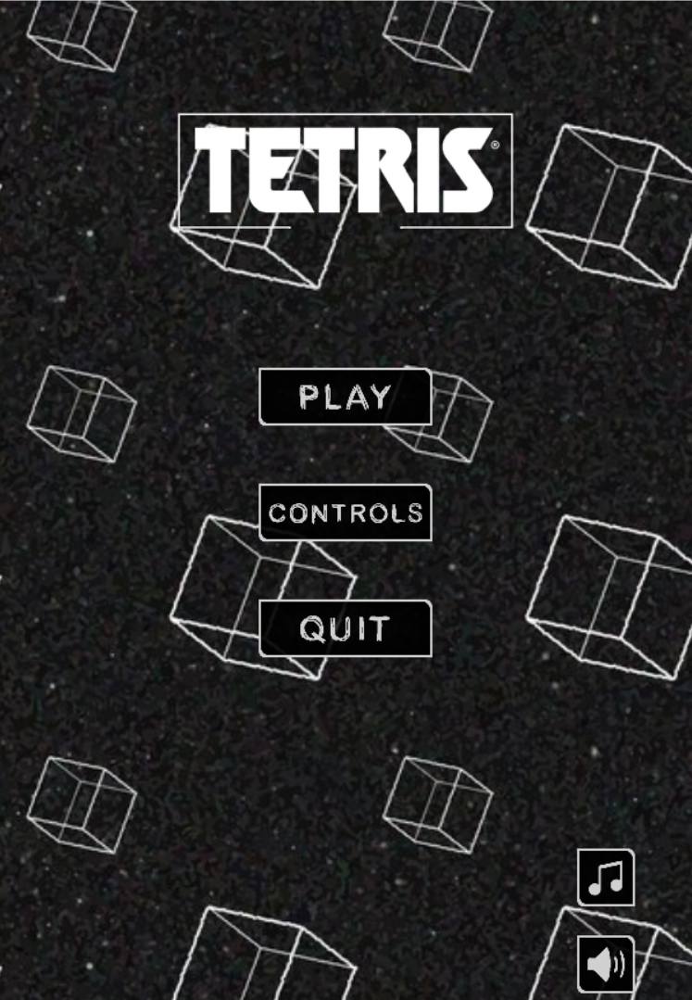
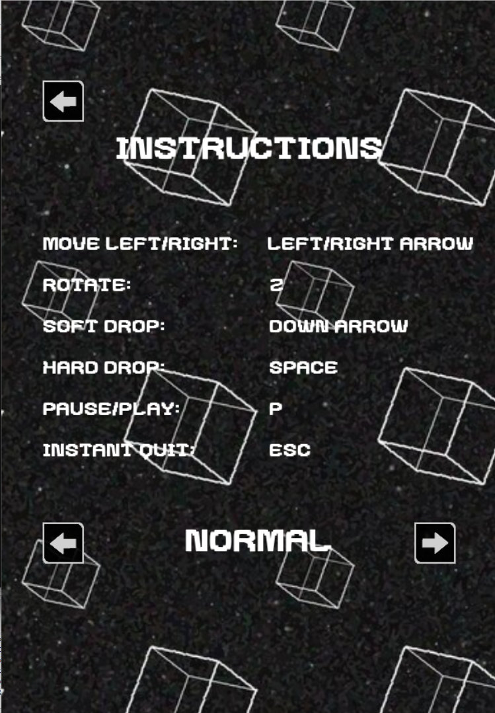

# TETRIS

Tetris - Basic game from C++ and SDL2

## Thông tin

- Nguyễn Minh Chiến
- MSSV: 23021491
- Lớp: K68 - CA1
- Mail: [nmc27705@gmail.com](nmc27705@gmail.com)

## Installation

- 1 - Clone repo về máy
- 2 - Mở project bằng CodeBlocks
- 3 - Run bằng file main.cpp

## Giới thiệu game

- Tetris là trò chơi logic và ghi điểm được lấy cảm hứng từ tetris cổ điển, người chơi sắp xếp các khối hình hộp rơi từ trên xuống để tạo ra hàng ngang đầy đủ, khi đó hàng sẽ biến mất và người chơi nhận điểm. Thách thức gia tăng khi tốc độ rơi tăng lên và không gian giảm đi.
- Game tự viết có thuật toán nằm ngoài chương trình, đồ họa thống nhất, âm thanh sống động.

#### Minh họa:

#### Cách chơi:

- **← →** để di chuyển khối
- **↓** để khối rơi nhanh hơn
- **Z** để xoay khối
- **Space** để thả khối
- **P** để dừng / tiếp tục chơi
- **ESC** để thoát trò chơi ngay lập tức

#### Tính năng:

- Logic game cơ bản
- Đồ họa
- Menu game
- Dừng / Tiếp tục
- Nhạc nền và hiệu ứng âm thanh
- Điểm và Kỉ lục
- Game Over -> Chơi lại
- Chọn độ khó (Normal / Hard)

#### Thư viện sử dụng:

- C++
- SDL2

#### Hỗ trợ

- Giảng viên hướng dẫn: TS. Trần Thị Minh Châu, Ths. Kiều Hải Đăng
- Lý thuyết: [Lazy' Foo](https://lazyfoo.net/tutorials/SDL/index.php)
- Game logic: [javilop](https://javilop.com/gamedev/tetris-tutorial-in-c-platform-independent-focused-in-game-logic-for-beginners/)

#### Nguồn tài nguyên

- [Hình ảnh](https://nectanebo.itch.io/menu-buttons)
- [Âm nhạc](https://www.youtube.com/watch?v=NmCCQxVBfyM)
- [Hiệu ứng âm thanh](https://coloralpha.itch.io/50-menu-interface-sfx)
- [Font](https://www.1001fonts.com/mix-bit-font-font.html)
